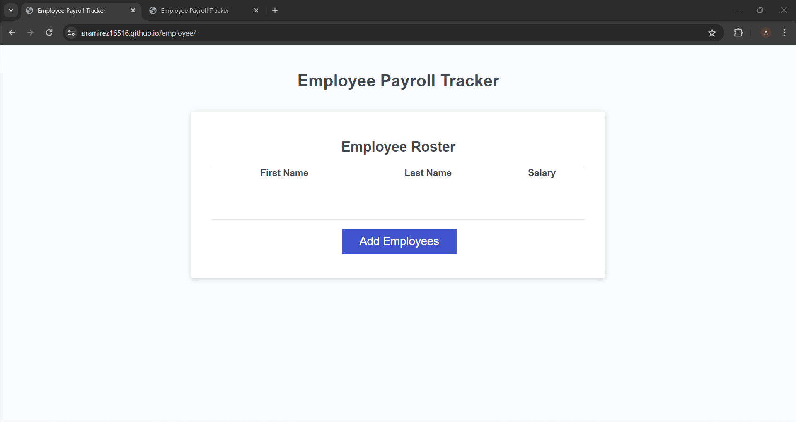

# module-challenge-3

## Description
This challenge provided an opportunity to work with JavaScript. The JavaScript file was updated with arrays, while loop, for loop, and object literal syntax. 

## Usage
Link: https://aramirez16516.github.io/employee/
Screenshot: 

## Credits
Class T.A. Leland Byrd and Andrea Presto
https://developer.mozilla.org/en-US/docs/Web/JavaScript/Reference/Template_literals
https://developer.mozilla.org/en-US/docs/Web/JavaScript/Reference/Global_Objects/Math/random

